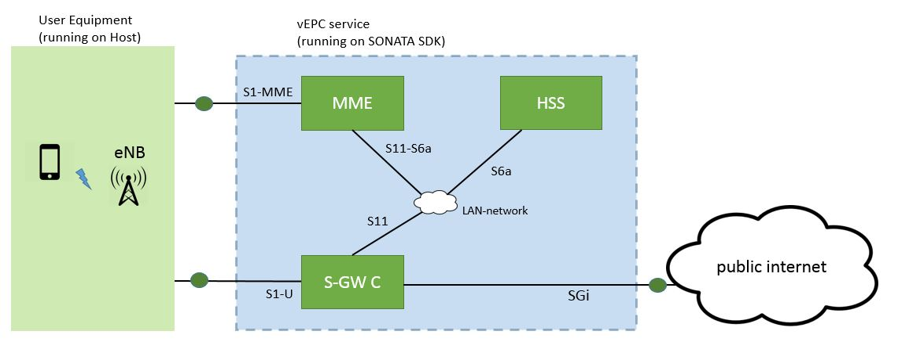

LTE EPC in Sonanta

## vEPC VNFs:
* MME with interfaces:
  * S1-MME : external access point
  * S11-S6a : connected to internal LAN
  * mgmt : management interface

* HSS with interfaces:
  * S1-U : connected to internal LAN
  * mgmt : management interface

* SPGW with interfaces
  * S11 : connected to internal LAN
  * S1-U : external access point
  * SGi : external access point
  * mgmt : management interface

